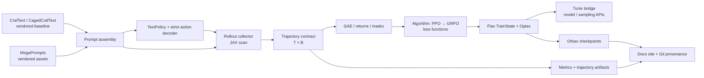

# Архитектура

## Слои и запреты

| Слой | Ответственность | Не имеет права знать |
| --- | --- | --- |
| `vendor/` | снимок CrafText, CagedCrafText, MegaPrompts | алгоритм обучения |
| `adapters/` | нормализовать reset/step, action mask, text/token encoding | PPO/GRPO loss |
| `rollout/` | batched scan, RNG partitioning, `Transition` | filesystem, логгер |
| `algorithms/` | GAE, clipped loss, KL/reward shaping | конкретная среда |
| `training/` | Flax state, Optax update, Tunix bridge | формат prompt YAML |
| `checkpointing/` | Orbax restore/save и schema version | env step loop |
| `reporting/` | metrics, benchmark JSON, docs provenance | мутабельный trainer state |

## Контракт траектории

`Transition` и `RolloutBatch` — главная точка совместимости. Все обязательные поля
батчированы, rollout time-major: observation/action/reward/terminated/truncated/
log_prob/value имеют первую пару осей `[T, B]`, а `bootstrap_value` — `[B]`.

Terminal state отделён от truncation: GAE маскирует настоящий terminal, а timeout
может bootstrap-иться по выбранной политике. Это решение тестируется отдельными
табличными примерами до первой оптимизации.

## CrafText adapter boundary

`CrafTextAdapter` и `CagedCrafTextAdapter` принимают vendor `reset(key, params)` и
`step(key, state, action, params)`, но отдают training-safe `EnvironmentReset` и
`EnvironmentStep`. Они фиксируют action mask как `[A]`, переводят vendor `done` в
`terminated` и создают явный all-false `truncated`: текущий vendor API не различает
timeout. Vendor `info` не протекает дальше boundary.

Contract golden fixture запускает два детерминированных CrafText-shaped env на 8-step
траекториях; real CrafText/Caged smoke test запускается только с extra `envs`. Следующий
шаг — заменить fixture на tiny world preset parity при установленном Craftax.

## Compiled rollout collection

`collect_rollout_scan` использует `jax.lax.scan` для фиксированного horizon и возвращает тот же
`RolloutBatch` `[T, B, ...]`, что и читаемый reference collector. Контракты зарегистрированы как
JAX PyTrees, поэтому collector можно оборачивать в `jax.jit`. Любой новый policy/env сначала
сверяется leaf-by-leaf с `collect_rollout`; compilation/warmup измеряется отдельно от steady state.

`Transition.done` использует `jax.numpy`, а `RolloutBatch.validate()` намеренно остаётся
host-side boundary-проверкой: она читает только static `shape` metadata и валидирует ведущие
оси каждой leaf во вложенных observation/action PyTrees. Регистрация PyTree находится в
`contracts.py`, а не у конкретного collector-а, поэтому контракт одинаково безопасен для
reference, scan и будущих learner-модулей.

Численные поля публичных `Transition` и `RolloutBatch` аннотированы как `jax.Array`:
после boundary они уже нормализованы и пригодны для JIT. Reference policy/step могут вернуть
`jax.typing.ArrayLike`, но collector сразу приводит такие значения в `jax.Array`. Небыстрый,
не-JIT reference collector намеренно stack-ает на host и нормализует один раз; compiled path
остаётся целиком JAX. Это допускает NumPy fixture в тесте, не размывая runtime-контракт trainer-а.

## Tunix как расширяемая граница

Tunix не должен становиться скрытой внутренней зависимостью. `TunixPolicyAdapter`
получит три небольших операции: `sample`, `log_prob_and_value`, `apply_gradients`.
Версия Tunix, сигнатуры и функциональный parity-smoke тест фиксируются в
`compatibility/tunix.yaml`. Изменение API — отдельный ADR и compatibility PR.

## Audit 2026-06-24: используемые внутренние проекты и единый pipeline

Внутренний стек сейчас опирается на три vendored проекта: CrafText/Craftax environment
baseline, CagedCrafText safety wrapper и MegaPrompts prompt assets. Снаружи core boundary
подключает JAX/Flax/Optax/Orbax, а Tunix, Flashbax, Qwix и CLU остаются optional extras,
закреплёнными за adapter/staging/interop/reporting слоями. Проверка согласованности не
выявила нарушений `vendor → adapters → rollout → algorithms → learner/checkpoints`:
обучающий путь идёт через `collect_batched_text_rollout`, `replays_from_batched_rollout`,
`text_trajectory_from_replay`, `masked_token_returns` и `masked_token_ppo_loss`.
Текущий action mask теперь enforced непосредственно перед `CrafTextAdapter.step`: если Tunix/Qwen
или любой другой backend выбирает запрещённый текущим состоянием action, pipeline либо падает
в `invalid_action="error"` режиме, либо использует явно настроенный fallback и записывает
`masked_action`/`fallback_used` в trajectory evidence.

Новый notebook `12_full_cycle_craftext_training.ipynb` фиксирует полный CrafText цикл на
маленьком deterministic backend: rollout, replay evidence, token batch, returns и masked
PPO update. Это не объявляет trainable Qwen/RLCluster готовым: production actor logprobs,
critic values и distributed workload остаются следующими explicit boundaries. Будущие PPO/DPO/
GRPO objectives должны подключаться через registry/typed batch contracts, а не менять
MegaPrompts, CrafText adapter или rollout transport.
