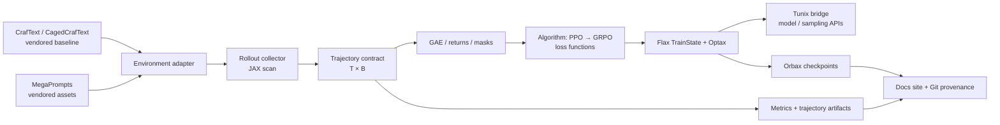

# Архитектура

## Слои и запреты

| Слой | Ответственность | Не имеет права знать |
| --- | --- | --- |
| `vendor/` | снимок CrafText, CagedCrafText, MegaPrompts | алгоритм обучения |
| `adapters/` | нормализовать reset/step, action mask, text/token encoding | PPO/GRPO loss |
| `rollout/` | batched scan, RNG partitioning, `Transition` | filesystem, логгер |
| `algorithms/` | GAE, clipped loss, KL/reward shaping | конкретная среда |
| `training/` | Flax state, Optax update, Tunix bridge | формат prompt YAML |
| `checkpointing/` | Orbax restore/save и schema version | env step loop |
| `reporting/` | metrics, benchmark JSON, docs provenance | мутабельный trainer state |

## Контракт траектории

`Transition` и `RolloutBatch` — главная точка совместимости. Все обязательные поля
батчированы, rollout time-major: observation/action/reward/terminated/truncated/
log_prob/value имеют первую пару осей `[T, B]`, а `bootstrap_value` — `[B]`.

Terminal state отделён от truncation: GAE маскирует настоящий terminal, а timeout
может bootstrap-иться по выбранной политике. Это решение тестируется отдельными
табличными примерами до первой оптимизации.

## Tunix как расширяемая граница

Tunix не должен становиться скрытой внутренней зависимостью. `TunixPolicyAdapter`
получит три небольших операции: `sample`, `log_prob_and_value`, `apply_gradients`.
Версия Tunix, сигнатуры и функциональный parity-smoke тест фиксируются в
`compatibility/tunix.yaml`. Изменение API — отдельный ADR и compatibility PR.
