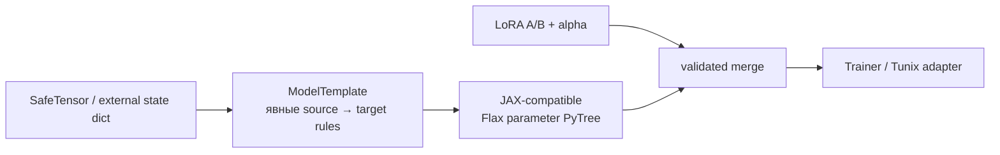

# Interoperability: внешние модели и LoRA в JAX

`tunix_craftext.interop` — отдельный слой переноса весов. Его цель — не «магически
поддержать любой checkpoint», а сделать каждый mapping проверяемым и воспроизводимым.



## Уже доступно

- Generic `state_dict` → вложенный PyTree с `identity` или `transpose_2d` mapping.
- Проверка отсутствующих/лишних tensor keys и ожидаемых shape.
- Стандартный merge LoRA для Flax kernel `[in_features, out_features]` без мутации base
  params. Внешние PEFT/PyTorch `down=[r,in]`, `up=[out,r]` преобразуются явно.
- Безопасная optional-загрузка HuggingFace `safetensors`; pickle checkpoints намеренно не
  читаются.

Внешний `state_dict`, safetensors и LoRA leaves принимаются как `jax.typing.ArrayLike`.
На границе они один раз нормализуются в рекурсивный `ParameterTree` с листьями `jax.Array`;
никакой `Any` не переходит в trainer или merge path.

## Минимальный template

```python
from tunix_craftext.interop import ModelTemplate, TensorRule, convert_state_dict

template = ModelTemplate("tiny", (
    TensorRule("linear.weight", ("Dense_0", "kernel"), "transpose_2d", (128, 64)),
    TensorRule("linear.bias", ("Dense_0", "bias"), expected_shape=(64,)),
))
params = convert_state_dict(external_state_dict, template)
```

Каждая новая архитектура получает свой версионируемый template, golden source tensors и
parity test output. Следующие adapters: полные HuggingFace config/model mapping, QLoRA
dequantization и Orbax export/import — только после таких parity tests.
